# FMECA-IPS Pipeline Flowchart

Renders natively on GitHub. Mirrors the real control flow executed by
`scripts/run_pipeline.py` (`01_pipeline.py` → `02_lifecycle.py` →
`04_export_transform_sample.py` → `03_export_app_data.py`): an outer loop over
`config.yaml`'s `failure_modes`, a nested inner loop over each mode's groups,
then a separate loop over the combined worksheet for RCM/LORA/supply/IETM/ECP.

```mermaid
flowchart TD
    subgraph S1["01_pipeline.py"]
    direction TB
        Start(["Start"]) --> LoadConfig["Load config.yaml<br/>parse failure_modes, assumptions, content"]
        LoadConfig --> ModeNext["mode = next failure mode"]
        ModeNext --> LoadCSV["Load events / readouts / groups CSV<br/>mode-specific columns"]
        LoadCSV --> Clean["6-step cleansing: sync -> drift removal -><br/>segmentation -> missing/outlier -><br/>code reconcile -> labeling"]
        Clean --> PerAsset["Per asset: rate(t) -> z(t) -> anomaly(t)<br/>-> t*, lead_time"]
        PerAsset --> GroupNext["group = next group in this mode"]
        GroupNext --> ComputeOSD["Compute O, S, D<br/>guide word + error %, detection rate, binomial test"]
        ComputeOSD --> OtherGroups{"Other groups<br/>in this mode?"}
        OtherGroups -- Yes --> GroupNext
        OtherGroups -- No --> OtherModes{"Other failure<br/>modes?"}
        OtherModes -- Yes --> ModeNext
        OtherModes -- No --> Combine["Combine all (failure_mode, group) rows<br/>RPN = OxSxD    RI = 0.4O + 0.4S + 0.2D"]
        Combine --> SaveWorksheet[/"Save fmeca_worksheet.csv etc. to outputs/"/]
    end

    subgraph S2["02_lifecycle.py"]
    direction TB
        RowNext["row = next worksheet row<br/>(failure_mode, group)"] --> RCMCheck{"Significant (p&lt;.05) &<br/>detection rate &gt;= 50%?"}
        RCMCheck -- Yes --> CBM["RCM = CBM<br/>(condition-based)"]
        RCMCheck -- No --> SCheck{"S &gt;= 5?"}
        SCheck -- Yes --> HardTime["RCM = Hard-Time<br/>(time-based)"]
        SCheck -- No --> RTF["RCM = RTF<br/>(run-to-failure)"]
        CBM --> OCheck{"O &gt;= 8?"}
        HardTime --> OCheck
        RTF --> OCheck
        OCheck -- Yes --> LORAHigh["LORA = elevate depot-repair priority<br/>+ forward stock"]
        OCheck -- No --> LORAStd["LORA = standard 2-level<br/>(field exchange + depot repair)"]
        LORAHigh --> Supply["Compute supply requirement<br/>(assumption + measured O)"]
        LORAStd --> Supply
        Supply --> IETMCheck{"Significant &<br/>lead time available?"}
        IETMCheck -- Yes --> IETMPre["IETM = pre-emptive SLA<br/>SLA = lead time x 0.5"]
        IETMCheck -- No --> IETMEnh["IETM = enhanced<br/>periodic inspection"]
        IETMPre --> ECPCheck{"RPN rank 1 / O=10 /<br/>not significant?"}
        IETMEnh --> ECPCheck
        ECPCheck -- Yes --> ECPCand["ECP = candidate<br/>(design change needed)"]
        ECPCheck -- No --> ECPNone["ECP = no change<br/>(no trigger)"]
        ECPCand --> SaveRow["Save result row"]
        ECPNone --> SaveRow
        SaveRow --> OtherRows{"Other worksheet<br/>rows?"}
        OtherRows -- Yes --> RowNext
        OtherRows -- No --> SaveLifecycle[/"Save lifecycle.csv/json"/]
    end

    subgraph S3["04_export_transform_sample.py + 03_export_app_data.py + feedback (web app)"]
    direction TB
        Sample["Auto-select sample assets per mode<br/>(1 detected + 1 missed) -> transform_sample.json"] --> ExportJSON[/"Generate dataset / fmeca / lifecycle /<br/>events / cleansing.json"/]
        ExportJSON --> CopyData[/"Copy app_data/ -> app/data/"/]
        CopyData --> FeedbackCheck{"ECP candidate<br/>exists?"}
        FeedbackCheck -- Yes --> Recompute["Recompute O'=O-2, D'=D-3 -><br/>RPN', RI', RCM', LORA', IETM', supply'"]
        FeedbackCheck -- No --> EndNode(["End"])
        Recompute --> EndNode
    end

    SaveWorksheet --> RowNext
    SaveLifecycle --> Sample
```

